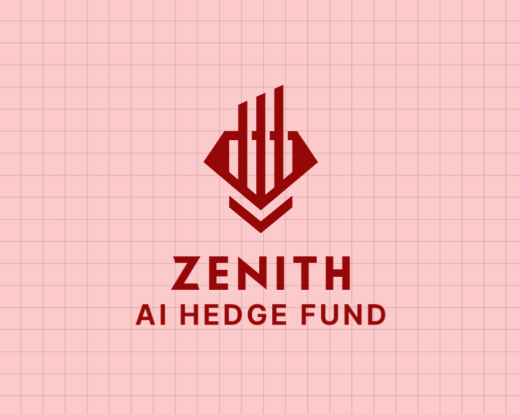
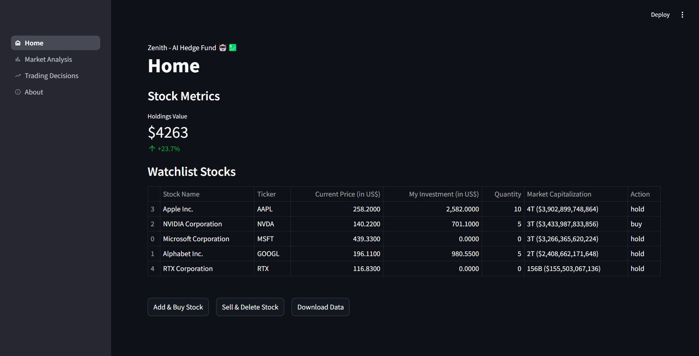
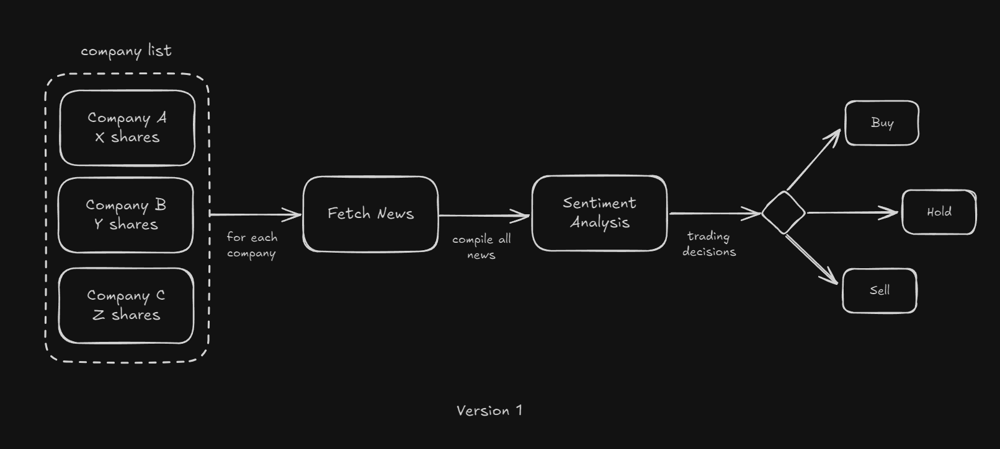

<p align="center">
    
</p>

<h1 align="center" style="text-align: center; font-size: 35px; font-weight: 700;">Zenith - AI Hedge Fund 🤖💹</h1>

<p align="center" style="text-align: center; font-size: 16px;">A proof of concept architecture of using AI models for market analysis and trading decisions. DYOR before using this for personal benefit.</p>



> [!IMPORTANT]
> This project is not yet ready for production use. It is a proof of concept and is not meant to be used for real-world trading.

## Development Checklist

If you can see this checklist, that means that this project is in its very early stages, and likely incomplete.

| Status         | Icon |
| -------------- | :--: |
| Not Started    | ⬜️  |
| In Development |  🟨  |
| Finished       |  ✅  |

- ✅ Add, Remove, Buy and Sell Stocks
- ✅ Start Research on a Stock (once a day)
- ⬜️ Redo Research on a Stock
- ✅ Display Research Data
- ✅ Display Research History
- ⬜️ Display Trading History
- AI Models
  - ✅ Gemini
  - ⬜️ OpenAI
  - ⬜️ Anthropic
  - ⬜️ Ollama (local LLMs)
- News API
  - ✅ NewsAPI.org
  - ⬜️ Yahoo Finance
  - ⬜️ Bloomberg

## Table of Contents

- [About](#about)
- [System Architecture](#system-architecture)
- [Getting Started](#getting-started)
  - [Prerequisites](#prerequisites)
  - [Installation](#installation)
  - [How to Use](#how-to-use)
- [Contributing](#contributing)
- [License](#license)
- [Star the Repo](#star-the-repo)

## About

This project is a proof of concept architecture of using AI models for market analysis and trading decisions. It is not meant to be used for real-world trading.

## System Architecture



This is a simple system architecture that uses Gemini as the trading API, NewsAPI.org for news, and a local LLM for research. This chart is made using Excalidraw.

## Getting Started

### Prerequisites

- Python 3.10+
- Gemini API Key (get from [Google AI Studio](https://aistudio.google.com))
- NewsAPI.org API Key (get from [NewsAPI.org](https://newsapi.org))

### Installation

1. Clone the repository
   ```bash
   git clone https://github.com/PolybitRockzz/zenith-ai-hedge-fund.git
   ```
2. Install the dependencies
   ```bash
   cd zenith-ai-hedge-fund
   python -m venv venv
   source venv/bin/activate
   pip install -r requirements.txt
   ```
3. Run the application
   ```bash
   streamlit run app.py
   ```

### How to Use

First, create directory named `data` in the root of the project.

Then, create a file named `companies.json` in the `data` directory, which is an empty JSON array for now. Also create a directory named `history` in the `data` directory. (This process will be automated in the future.)

After that, you can start the application by running `streamlit run app.py` in the root of the project.

There are 4 pages in the application:

- **Home**: This is the home page of the application. It is the first page that you will see when you open the application.
- **Market Analysis**: This is the page where you prompt the AI to analyze the market, and it will return a list of stocks that you can trade and the reasoning behind it.
- **Trading Decisions**: This is the page where you can view your previous trading decisions, and the AI's analysis of the market.
- **About**: This is the page where you can learn more about the application.

## Contributing

Contributions are welcome! Please feel free to submit a pull request.

## License

This project is open-sourced under the Apache License 2.0 - see the [LICENSE](LICENSE) file for details.

## Star the Repo

<div align="center">
<a href="https://star-history.com/#PolybitRockzz/zenith-ai-hedge-fund&Date">
 <picture>
   <source media="(prefers-color-scheme: dark)" srcset="https://api.star-history.com/svg?repos=PolybitRockzz/zenith-ai-hedge-fund&type=Date&theme=dark" />
   <source media="(prefers-color-scheme: light)" srcset="https://api.star-history.com/svg?repos=PolybitRockzz/zenith-ai-hedge-fund&type=Date" />
   
 </picture>
</a>
</div>

If you find this project useful, please consider starring the repository to show your support!
